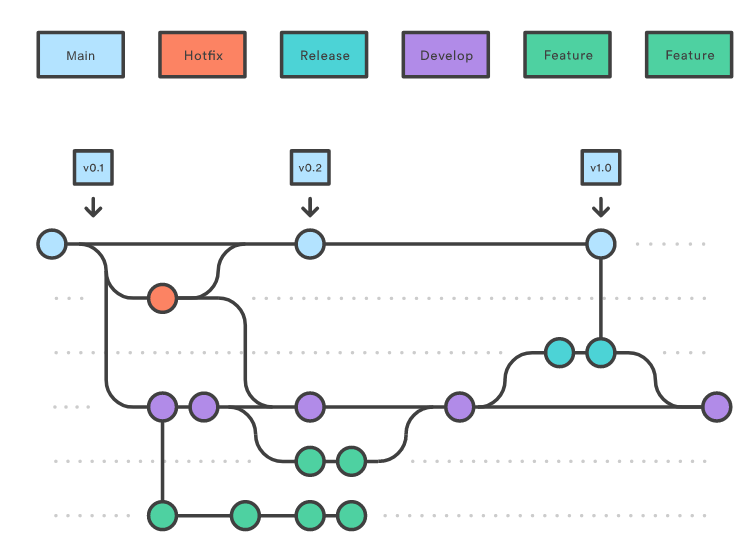
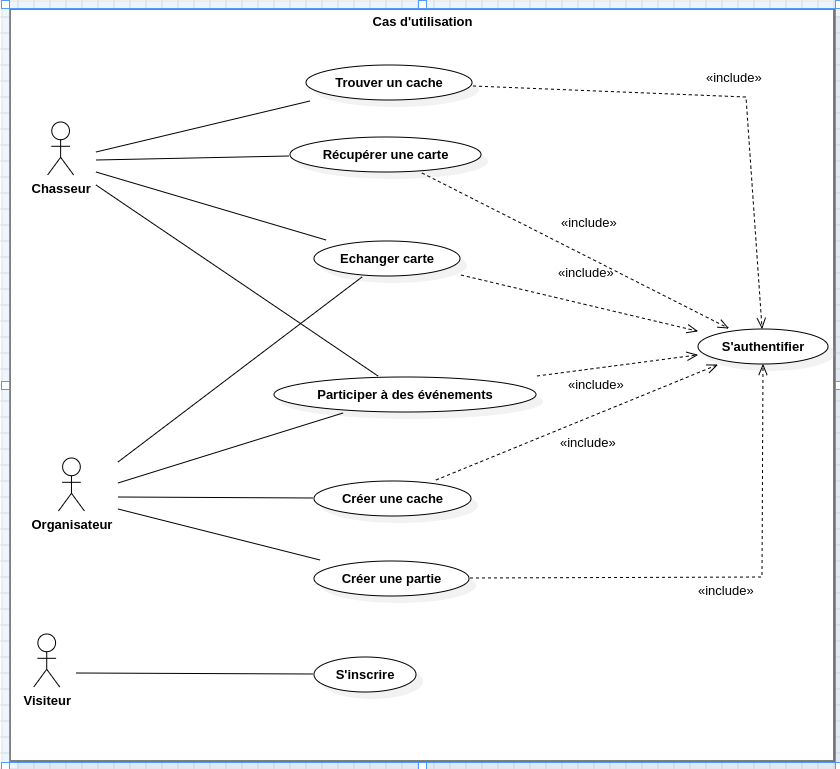
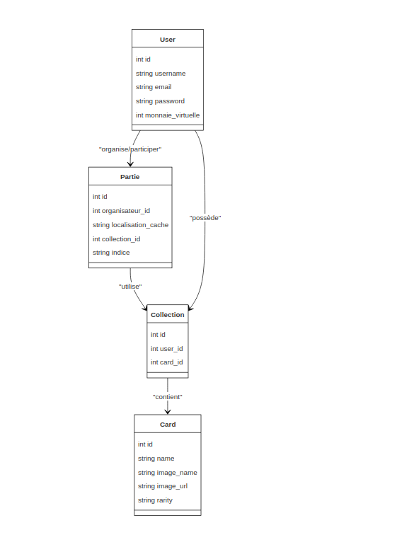
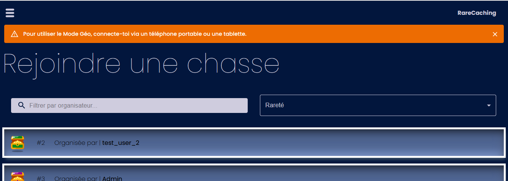
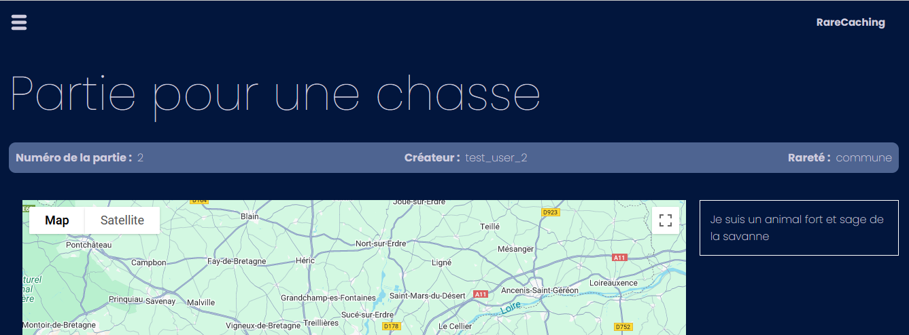
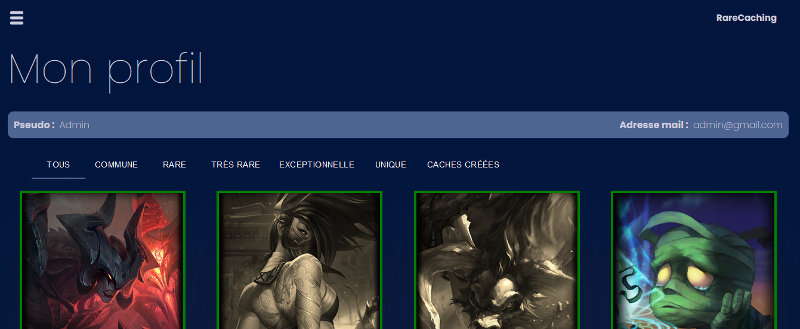
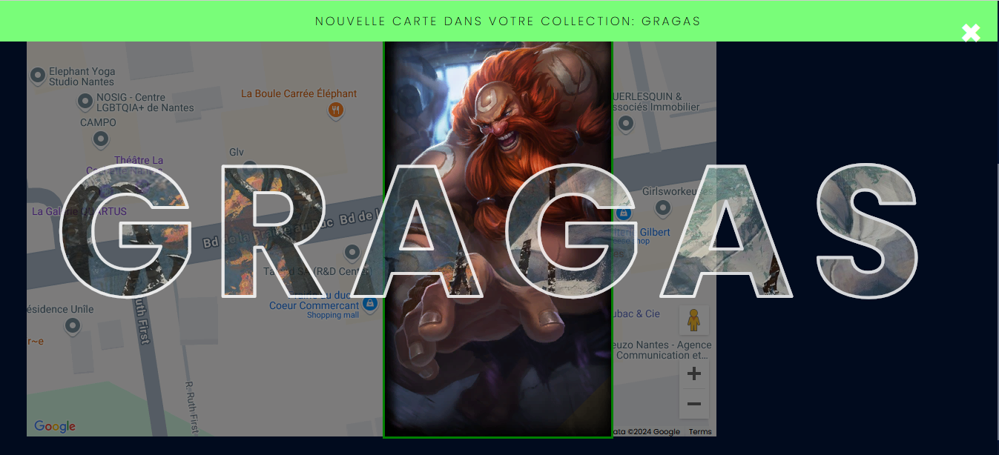
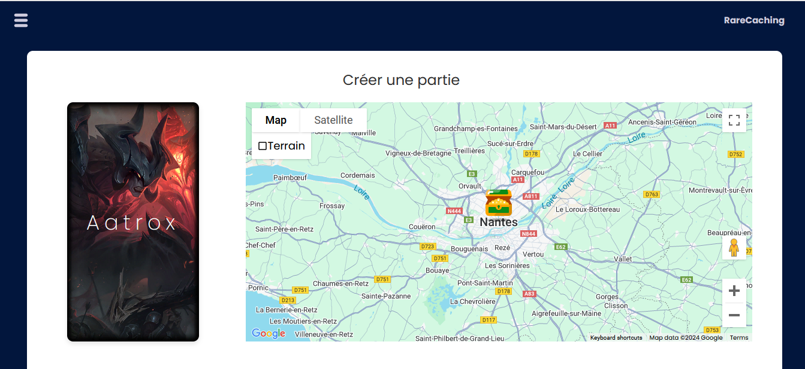
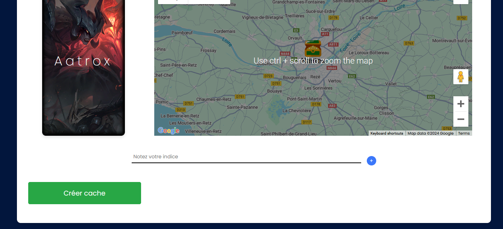

# RareCaching
Le projet RareCaching fusionne le géocaching et les NFT. Il propose une plateforme ludique (Web/App) où les utilisateurs peuvent chercher des caches en réalité augmentée ou sur des cartes numériques pour obtenir des NFT. Les utilisateurs peuvent être chasseurs ou organisateurs, ces derniers créant des caches avec leurs propres NFT.
Deux modes de jeu sont proposés :

    Geo : déplacement physique et chasse avec des appareils connectés.
    Map : chasse exclusivement sur carte numérique. 
## Choix des technologies:
Frontend :

    React.js pour la gestion de l’interface utilisateur et l’interactivité. 

Backend :

    Python avec un framework  Flask pour la création de l’API REST. 

Base de données :

    MySQL comme base de données pour stocker les utilisateurs, caches et informations liées aux NFT qui est héberger sur le clever cloud. 

## Worklow:

On a choisi d'utiliser Gitflow pour les raisons ssuivantes:
    Permettre un déploiement et une intégration continue avec Heroku
    Pour garantir une application fonctionnelle et capable d'accepter des changements pendant sa période de vie
    Mise en place de processus de testing et qualité de code automatique

Les branches utilisées

    Main
        La branche déployée
        Règle de nommage: X.Y.Z
            X: version majeure, changée suite à de grands changements
            Y: version mineur, changée suite à des changements moins conséquents (ajout d'une fonctionnalité, changement de design / visuels...)
            Z: patch, changée suite à des correctifs ou des hotfixes
    Develop
        Branche de développement générale
        Règle de nommage: version future de la main - date de release - titre de la feature / changement
    Feature
        Branche de développement d'une fonctionnalité spécifique
        Règle de nommage: Titre - Date

Occasionnellement, on utilise une branche Hotfix lié à la main pour réparérer des problèmes majeurs en prod

    Hotfix:
        Branche créé en cas de bug en prod, contient le correctif
        Règle de nommage:
            Hotfix / Documentation - numéro de l'issue - date
            Exemple : 'Hotfix - 13 - 03/04'

## Diagramme de cas d'utilisation
### Acteurs

- Visiteur : Un utilisateur qui n'a pas encore de compte sur la plateforme.  
- Chasseur : Un utilisateur authentifié qui cherche des caches sur la plateforme.
- Organisateur : Un utilisateur authentifié qui crée des caches pour les autres utilisateurs.

- L'action S'authentifier est incluse dans plusieurs cas d'utilisation (trouver une cache, participer à des événements, etc.) car elle est une condition préalable pour réaliser ces actions.
- Le Chasseur a accès aux caches et événements après s'être authentifié, tandis que le Visiteur doit d'abord s'inscrire.
- L'Organisateur dispose de privilèges pour créer et gérer des caches, mais doit également être authentifié.
## Diagramme de classe
Le diagramme de classes montre que chaque Utilisateur possède des Collections, qui contiennent des Cartes. Les utilisateurs participent à des Parties et utilisent leurs collections. Chaque partie est liée à des Indices pour guider les joueurs. Cela organise les interactions et assure une bonne gestion des données.

## Interface
1. Rejoindre une partie / liste de parties

Permet aux utilisateurs de voir et de rejoindre des parties de chasse. Un champ de recherche et des filtres par organisateur et rareté sont disponibles. Un message en haut de l’écran recommande l’utilisation d’un mobile ou d’une tablette pour le mode jeu. 

2. Ecran de jeu

Affiche les détails d’une partie spécifique, incluant le numéro de partie, le créateur et la rareté. Une carte interactive permet aux joueurs de visualiser leur environnement, avec un espace pour des indices.

3. les cartes

Cette partie affiche la liste des cartes

4. Ecran de la victoire
Cet écran s’affiche lorsque le joueur obtient une nouvelle carte après avoir remporté une partie. La carte obtenue est mise en avant avec son nom en grand, et un message en haut confirme son ajout à la collection. L’arrière-plan montre une carte géographique, ajoutant au contexte de la victoire.

5. Création d’une partie
Cet écran permet aux utilisateurs de créer une nouvelle partie de chasse. Ils peuvent sélectionner un emplacement sur la carte et fournir des indices pour guider les joueurs. Un bouton « Créer cache » valide la création de la partie, ajoutant ainsi une nouvelle chasse à la liste des parties disponibles.

